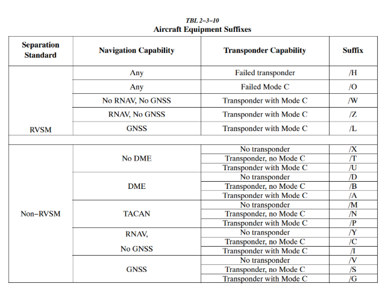
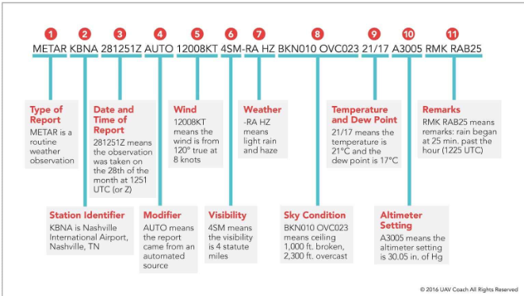
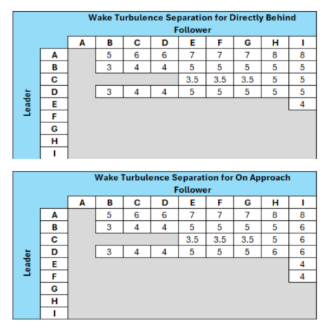

## HCF Training Syllabus

### Student 1 (S1) Training

#### S1 Lesson 1 – Setup

**CRC Client Setup**

- The current software client for VATSIM USA is **CRC** ([https://vnas.vatsim.net/crc](https://vnas.vatsim.net/crc)).
    - The most commonly used client for Ground Control and Clearance Delivery is **Tower Cab** mode.
    - To set up **CRC**, download it from the URL listed above.

Your Mentor/Instructor will provide further details on setting up the client and learning how to connect.

- In addition to **CRC**, you will also be instructed to download and use **vStrips** and **vTDLS**.
    - **vStrips** is a web-based simulation of the paper flight progress strips used by FAA controllers in air traffic control towers. The application is used alongside a primary controlling client, such as **CRC**. Controllers logged in to the same **vStrips** facility share a set of flight strip bays that automatically update whenever a controller adds, moves, edits, or deletes a flight strip.
        - **vStrips** also offers a variety of features that mirror realistic workflows, including the ability to add separators between flight strips, create custom half-strips for temporary or VFR flight plans, and offset strips to the side of a rack.
    - **vTDLS** is a high-fidelity simulation of the real-life FAA TDLS (Tower Data-Link Services) system that allows controllers to send pre-departure clearances (PDCs) to aircraft. **vTDLS** greatly reduces the workload of clearance-delivery controllers at equipped airports, particularly during departure-heavy events, as it allows controllers to review flight plans and send PDCs to pilots before they even connect to the network.

#### S1 Lesson 2 – Oral

##### Airspace Information

- **Class E** – Controlled airspace with only a transponder being required above Class C, above 10,000 ft, and within a Class B Mode C veil.
- **Class D** – Only two-way radio communication is needed. Only aircraft requesting radar services under approach control and IFR traffic need squawk codes.
- **Class C** – Aircraft are required to have a transponder and two-way radio communication. Most aircraft will be given a squawk code depending on direction, altitude, radar services, or intentions.
- **Class B** – Aircraft are required to have a clearance, transponder within the 30-mile Mode C veil, and two-way radio communication. All aircraft, VFR or IFR, will be given a squawk code.
- **Class A** – Aircraft are required to be on an IFR flight plan, clearance, transponder, and two-way radio communication.

##### Clearance Information

Clearances for IFR flight are given using the CRAFT acronym:

*Clearance Limit / Route of flight / Altitude / Frequency / Transponder Code.*

Clearances for VFR operations in, out, or through Class B airspace are as follows:

!!! quote "Phraseology"
    N123AB CLEARED THROUGH / TO ENTER / OUT OF BRAVO AIRSPACE.

#### S1 Lesson 3 – Oral

##### Movement vs. Non-Movement

**Movement areas** are areas on the airport such as taxiways and runways. These are areas that aircraft must have permission to move about, take off, or land on.

**Non-Movement areas** are areas on the airport such as the terminal ramp, general aviation ramp, or military ramps. These are locations where aircraft can move about without permission from the controller.

##### Taxi Information

**Fixed Wing** – These aircraft taxi in the normal way you see on an airport when flying on an airliner or flying with a friend. The correct way to issue a taxi clearance is:

!!! quote "Phraseology"
    FDX9260 RUNWAY 4R TAXI VIA C, ALTIMETER 30.11.

    FDX9260 TAXI TO PARKING VIA C.

!!! note
    You do not have to give the altimeter if they call with the current ATIS or numbers.

**Helicopters** – Helicopters have several ways they can taxi. They can surface taxi, hover taxi, or air taxi. However, helicopters will generally take off from their present position.

- **Surface Taxi** – Helicopters that have wheels would taxi like a normal aircraft.
- **Hover Taxi** – When requested or necessary for a helicopter/VTOL aircraft to proceed at a slow speed above the surface, normally below 20 knots and in ground effect, use the following phraseology. If needed, you can issue **CAUTION** (dust, blowing snow, loose debris, taxiing light aircraft, personnel, etc.).

    !!! quote "Phraseology"
        HELICOPTER N123AB RUNWAY 4R HOVER TAXI VIA C.

- **Air Taxi** – When requested or necessary for a helicopter to proceed expeditiously from one point to another, normally below 100 feet AGL and at airspeeds above 20 knots, use the following phraseology.

    !!! quote "Phraseology"
        HELICOPTER N123AB AIR TAXI VIA (direct, as requested, or specified route) TO (location, heliport, helipad, operating/movement area, active/inactive runway), AVOID (aircraft/vehicles/personnel). If required, REMAIN AT OR BELOW (altitude). CAUTION (wake turbulence or other reasons above). LAND AND CONTACT TOWER, or HOLD FOR (reason — takeoff clearance, release, landing/taxiing aircraft, etc.).

##### RVSM Airspace

Reduced Vertical Separation Minima/Minimum (RVSM) is a reduction from 2,000 feet to 1,000 feet of the standard vertical separation required between aircraft flying between flight level 290 (29,000 ft) and flight level 410 (41,000 ft). This reduction in vertical separation minima therefore increases the number of aircraft that can fly in a particular volume of controlled airspace.

Aircraft must be RVSM capable to cruise between FL290 and FL410. Aircraft can cruise above FL410 non-RVSM capable; however, they cannot level off in RVSM airspace.

Above RVSM airspace, separation will be 2,000 ft, resulting in all cruising altitudes being odd, alternating for direction of flight.

#### S1 Lesson 4 – Oral

##### Equipment Codes

You will see an image attached with the most common/simple equipment suffixes that include both RVSM and non-RVSM codes.

##### Weather

#### S1 Checklist

##### CRC

- [ ] Can connect to CRC on an active position (Sweatbox)
- [ ] Properly establishes and communicates two-way radio communication

##### Weather

- [ ] Cloud reporting
- [ ] Can fully decode a METAR, including: station identification; time observation was made; wind (including variable, gusts); altimeter setting; temperature and dew point (and explains relationship); identified cloud types; and when a ceiling is present
- [ ] Properly decodes METAR and TAF

##### Clearance Delivery

- [ ] Can explain the parts of a flight plan
- [ ] Clearance information
- [ ] RVSM airspace
- [ ] Equipment codes
- [ ] Issues clearances using prescribed phraseology
- [ ] Identifies flight plan altitudes that do not correspond with NE-ODD/SW-EVEN
- [ ] Processes amendments to the flight plan
- [ ] Identifies errors in flight plans and corrects them
- [ ] Defines all parts of a clearance
- [ ] Explains all types of SIDs
- [ ] Defines what RVSM is and how it differs from the normal direction-of-flight altitude rules
- [ ] Defines all parts of a flight plan
- [ ] Defines, compares, and contrasts /A, /G, /L, and /Z equipment suffixes
- [ ] Identifies, compares, and contrasts at minimum the differences between VOR and area navigation
- [ ] Ensures flight plans comply with restrictions regarding navigation type by identifying /A, /G, and /L
- [ ] Issues a VFR Class B clearance, including discrete beacon code
- [ ] Informs the pilot of ATIS if they do not call in, along with runway and altimeter settings as needed
- [ ] Ensures readback is correct with prescribed phraseology
- [ ] Clearance issuance: at least 90% of IFR clearances contain no errors
- [ ] Clearance issuance: at least 90% of VFR clearances contain no errors
- [ ] Readback and hearback are assured

##### Ground Control

- [ ] Movement vs. non-movement
- [ ] Taxi information
- [ ] Defines movement and non-movement areas
- [ ] Issues taxi instructions to an active runway utilizing prescribed phraseology
- [ ] Issues taxi to a runway for an intersection departure using prescribed phraseology
- [ ] Explains the special significance of heavy/super ground movement
- [ ] Arriving aircraft are taxied to the requested destination IAW FAA Order 7110.65
- [ ] Departing aircraft are taxied to their runway IAW FAA Order 7110.65
- [ ] No runway incursions occur
- [ ] No multiple runway crossings are issued
- [ ] Aircraft are squawking altitude encoding before takeoff
- [ ] Proper sequencing is utilized, including but not limited to departure sequencing and proper give-way/follow instructions
- [ ] Identifies the floor/ceiling of Class C airspace and requirements to operate within

#### S1 Lesson 5 – Sweatbox

This lesson is a Sweatbox scenario. The MTR/INS will run this session, handling IFR and VFR traffic at PHOG or PHNL. This lesson will be repeated until the Instructor or Mentor feels that the student is ready for their rating check-out.

##### 1. Demonstrates knowledge of Delivery and Ground Controller duties and responsibilities

- Defines all parts of a clearance.
- Explains all types of SIDs.
- Defines what RVSM is and how it is used on VATSIM.
- Defines all parts of a flight plan.
- Defines, compares, and contrasts /A, /G, and /L equipment suffixes.
- Identifies the difference between movement and non-movement areas.

##### 2. Clearance Issuance

- IFR clearances are issued IAW the standard.
- VFR clearances are issued IAW the standard.

##### 3. Ground Movement

- Arriving aircraft are taxied to the requested destination IAW the standard.
- Departing aircraft are taxied to their runway IAW the standard.
- No runway incursions occur.
- Runway crossings are issued IAW the standard.
- Aircraft are squawking altitude encoding if required.
- Proper sequencing is utilized, including but not limited to proper use of follow/behind.
- Helicopter ground movements are issued IAW the standard.

##### Session Checklist Items

- [ ] Can connect to CRC on an active position (Sweatbox)
- [ ] Properly establishes and communicates two-way radio communication
- [ ] Can explain parts of the clearance
- [ ] Issues clearances using prescribed phraseology
- [ ] Identifies flight plan altitudes that do not correspond with NE-ODD/SW-EVEN
- [ ] Identifies, compares, and contrasts at minimum the differences between VOR and area navigation
- [ ] Ensures flight plans comply with restrictions regarding navigation type by identifying /A, /G, and /L
- [ ] Issues a VFR Class Bravo clearance, including discrete beacon code
- [ ] Can fully decode a METAR, including: station identification; time observation was made; wind (including variable, gusts); altimeter setting; temperature and dew point (and explains relationship); identified cloud types; and when a ceiling is present
- [ ] Processes amendments to the flight plan
- [ ] Identifies errors in flight plans and corrects them
- [ ] Identifies four types of SIDs; defines pilot-nav, radar-nav, and hybrid-nav SIDs
- [ ] Ensures readback is correct with prescribed phraseology
- [ ] Informs the pilot of ATIS if they do not call in with it, along with runway and altimeter settings as needed
- [ ] Defines movement and non-movement areas
- [ ] Issues taxi instructions to an active runway utilizing prescribed phraseology
- [ ] Issues taxi to a runway for an intersection departure using prescribed phraseology

!!! success "Rating Award"
    Upon completion of the lessons and successful Sweatbox and/or live sessions, the Instructor will issue the S1 rating for all Unrestricted facilities.

#### S1 Lesson 6 – Tier 2 Familiarization

Tier 2 Familiarization is the structured process of learning and demonstrating knowledge of the procedures, airspace, and operational practices associated with a VATUSA-designated Tier 2 facility, as a prerequisite to receiving authorization to control those positions independently.

##### What Is a Tier 2 Facility?

Under the VATSIM Global Controller Administration Policy (GCAP), certain ATC positions are designated as Tier 1, Tier 2, or Super Center because they require additional local knowledge and demonstrated competency. Tier 2 positions typically include:

- Major international airports
- Complex Class B terminal environments
- High-traffic TRACON operations

The Daniel K. Inouye International Airport (HNL), HCF Approach Control, and HCF ARTCC are all considered Tier 2 facilities.

##### Definition of Tier 2 Familiarization

Tier 2 Familiarization is the instructional process that introduces a controller to:

1. Local Standard Operating Procedures (SOPs)
2. Airspace structure and sector boundaries
3. Runway configurations and traffic flows
4. Letters of Agreement (LOAs)
5. Special coordination procedures
6. Preferred routing and sequencing techniques
7. Controller proficiency expectations

The purpose is to ensure the controller can safely and efficiently operate within that complex airspace before receiving a formal Tier 2 endorsement.

Tier 2 familiarization may include:

- Self-study of SOPs and LOAs
- Written examinations
- One or more mentor or instructor sessions
- Monitoring and practical evaluation

Controllers who may need Tier 2 familiarization include:

- Home controllers seeking designated endorsements
- Transfer controllers
- Visiting controllers
- Controllers upgrading to higher ratings

A controller in Honolulu Control Facility seeking certification on Daniel K. Inouye International Airport Tower or Approach may complete Tier 2 familiarization covering:

- Inter-island traffic flows
- Simultaneous runway operations
- Military coordination
- Oceanic and En Route interfaces

After demonstrating understanding and operational competence, the controller may receive the Tier 2 endorsement authorizing independent control.

For students who have transferred into HCF and already hold an S1 unrestricted rating, a review of Lesson 5 on both Sweatbox and/or live will be conducted until the Instructor or Mentor feels that the student can efficiently operate within the S1 Tier 2 airspace.

### Student 2 (S2) Training

!!! info
    Training fields will be at both PHNL and PHOG.

#### S2 Lesson 1 – Oral: Tier 2 Familiarization

Tier 2 Familiarization is the structured process of learning and demonstrating knowledge of the procedures, airspace, and operational practices associated with a VATUSA-designated Tier 2 facility, as a prerequisite to receiving authorization to control those positions independently.

##### What Is a Tier 2 Facility?

Under the VATSIM Global Controller Administration Policy (GCAP), certain ATC positions are designated as Tier 1, Tier 2, or Super Center because they require additional local knowledge and demonstrated competency. Tier 2 positions typically include:

- Major international airports
- Complex Class B terminal environments
- High-traffic TRACON operations

The Daniel K. Inouye International Airport (HNL), HCF Approach Control, and HCF ARTCC are all considered Tier 2 facilities.

##### Definition of Tier 2 Familiarization

Tier 2 Familiarization is the instructional process that introduces a controller to:

- Local Standard Operating Procedures (SOPs)
- Airspace structure and sector boundaries
- Runway configurations and traffic flows
- Letters of Agreement (LOAs)
- Special coordination procedures
- Preferred routing and sequencing techniques
- Controller proficiency expectations

The purpose is to ensure the controller can safely and efficiently operate within that complex airspace before receiving a formal Tier 2 endorsement.

Tier 2 familiarization may include:

- Self-study of SOPs and LOAs
- Written examinations
- One or more mentor or instructor sessions
- Monitoring and practical evaluation

Controllers who may need Tier 2 familiarization include:

- Home controllers seeking designated endorsements
- Transfer controllers
- Visiting controllers
- Controllers upgrading to higher ratings

A controller in Honolulu Control Facility seeking certification on Daniel K. Inouye International Airport Tower or Approach may complete Tier 2 familiarization covering:

- Inter-island traffic flows
- Simultaneous runway operations
- Military coordination
- Oceanic and En Route interfaces

#### S2 Lesson 2 – Oral

This lesson covers the following topics:

- Runway selection
- Landing clearances
- Wake turbulence
- Special VFR
- Land and hold short
- Traffic pattern
- Helicopter operations
- Line-up and wait
- Intersection departures
- Line-up and wait procedures are properly utilized IAW FAA Order 7110.65
- Intersection departures are conducted IAW FAA Order 7110.65
- Wake turbulence separation is adhered to

##### Runway Selection

Select the runway most nearly aligned with the wind when 5 knots or more, or the "calm wind" runway when less than 5 knots, unless use of another runway will be operationally advantageous or is requested by the pilot.

!!! note "Tailwind Components"
    When authorizing use of runways and a tailwind component exists, always state both wind direction and velocity.

##### Landing Clearances

When issuing a clearance to land, first state the runway number, followed by the landing clearance. If the landing runway is changed, controllers must preface the landing clearance with "Change to runway" followed by the runway number. Controllers must then restate the runway number, followed by the landing clearance.

!!! quote "Phraseology"
    RUNWAY (number) CLEARED TO LAND.

    CHANGE TO RUNWAY (number), RUNWAY (number) CLEARED TO LAND.

##### Takeoff Clearances

When issuing a clearance for takeoff, first state the runway number, followed by the takeoff clearance.

!!! quote "Phraseology"
    RUNWAY (number), CLEARED FOR TAKEOFF.

!!! example
    RUNWAY TWO SEVEN, CLEARED FOR TAKEOFF.

##### Wake Turbulence

!!! note
    This is a simplified version of Wake Turbulence, for full information on Wake Turbulence, see [Consolidated Wake Turbulence](../../references/Consolidated%20Wake%20Turbulence.md). You may also reference the 7110.65. 

**Aircraft taking off**
Apply wake turbulence procedures to an aircraft operating behind another aircraft when wake turbulence separation is required. Separate aircarft take off by:

Heavy, large, or small behind super - 3 minutes

Heavy. large or small behind heavy - 2 minutes

Small behind B757 - 2 minutes

**Aircraft landing**
Air Traffic Wake Turbulence Separations
Because of the possible effects of wake turbulence, controllers are required to apply no less than minimum required separation to all aircraft operating behind a Super or Heavy, and to Small aircraft operating behind a B757, when aircraft are IFR; VFR and receiving Class B, Class C, or TRSA airspace services; or VFR and being radar sequenced.
Separation is applied to aircraft operating directly behind a super or heavy at the same altitude or less than 1,000 feet below, and to small aircraft operating directly behind a B757 at the same altitude or less than 500 feet below:

(a) Heavy behind super - 6 miles.

(b) Large behind super - 7 miles.

(c) Small behind super - 8 miles.

(d) Heavy behind heavy -4 miles.

(e) Small/large behind heavy - 5 miles.

(f) Small behind B757 - 4 miles.

##### SVFR Operations

!!! quote "Reference"
    FAA Order JO 7110.65, Para 2-1-4, Operational Priority.

SVFR operations in weather conditions less than basic VFR minima are authorized:

- At any location not prohibited by 14 CFR Part 91, Appendix D, or when an exemption to 14 CFR Part 91 has been granted and an associated LOA has been established. 14 CFR Part 91 does not prohibit SVFR helicopter operations.
- Only within the lateral boundaries of Class B, Class C, Class D, or Class E surface areas, below 10,000 feet MSL.
- Only when requested by the pilot.
- Based on weather conditions reported at the airport of intended landing/departure.
- When weather conditions are not reported at the airport of intended landing/departure, and the pilot advises that VFR cannot be maintained and requests SVFR.
- SVFR operations may be authorized for aircraft operating in or transiting a Class B, Class C, Class D, or Class E surface area when the primary airport is reporting VFR, but the pilot advises that basic VFR cannot be maintained.

##### Land and Hold Short (LAHSO)

An aircraft may be authorized to take off from one runway while another aircraft lands simultaneously on an intersecting runway; or an aircraft lands on one runway while another aircraft lands simultaneously on an intersecting runway; or an aircraft lands to hold short of an intersecting taxiway or some other predetermined point, such as an approach/departure flight path, using procedures specified in the current LAHSO directive. The procedure must be approved by the air traffic manager and be in accordance with a facility directive. The following conditions apply:

A simultaneous takeoff and landing operation must only be conducted in VFR conditions.

Instruct the landing aircraft to hold short of the intersecting runway being used by the aircraft taking off. In the case of simultaneous landings and where no operational benefit is lost, restrict the aircraft of the lesser weight category (if known). LAHSO clearances must only be issued to aircraft that are listed in the current LAHSO directive, whose Available Landing Distance (ALD) does not exceed the landing distance requirement for the runway condition.

!!! quote "Phraseology"
    HOLD SHORT OF RUNWAY (runway number), (traffic, type aircraft, or other information).

Issue traffic information to both aircraft involved and obtain an acknowledgment from each. Request a readback of hold-short instructions when they are not received from the pilot of the restricted aircraft.

Issue the measured distance from the landing threshold to the hold-short point, rounded "down" to the nearest 50-foot increment, if requested by either aircraft.

There is no tailwind for the landing aircraft restricted to hold short of the intersection. The wind may be described as "calm" when appropriate.

##### Traffic Pattern

Airport traffic patterns are developed to ensure that air traffic is flown into and out of an airport safely. Each airport traffic pattern is established based on the local conditions, including the direction and placement of the pattern, the altitude at which it is to be flown, and the procedures for entering and exiting the pattern. A traffic pattern consists of an upwind, crosswind, downwind, base, and final leg.

To separate traffic in the traffic pattern, there are several options available:

- Extend a leg of the pattern.
- Left/right 360s.
- Make a right/left 270 on base.
- Make a short approach.
- Follow traffic.

##### Helicopter Operations

**Helicopter Takeoff Clearance from Movement Area** – Issue takeoff clearances from movement areas other than active runways or in diverse directions from active runways, with additional instructions as necessary. Whenever possible, issue takeoff clearance in lieu of extended hover-taxi or air-taxi operations.

!!! quote "Phraseology"
    (Present position, taxiway, helipad, numbers) MAKE RIGHT/LEFT TURN FOR (direction, points of compass, heading, NAVAID radial) DEPARTURE/DEPARTURE ROUTE (number, name, or code), AVOID (aircraft/vehicles/personnel), or REMAIN (direction) OF (active runways, parking areas, passenger terminals, etc.). CAUTION (power lines, unlit obstructions, trees, wake turbulence, etc.). CLEARED FOR TAKEOFF.

**Helicopter Takeoff from Non-Movement Area** – If takeoff is requested from non-movement areas, an area not authorized for helicopter use, or an area off the airport, and, in your judgment, the operation appears to be reasonable, use the following phraseology instead of the takeoff clearance.

!!! quote "Phraseology"
    DEPARTURE FROM (requested location) WILL BE AT YOUR OWN RISK (additional instructions, as necessary). USE CAUTION (if applicable).

**Helicopter Landing Clearance at Movement Area** – Issue landing clearances to helicopters going to movement areas other than active runways or from diverse directions to points on active runways, with additional instructions as necessary. Whenever possible, issue a landing clearance in lieu of extended hover-taxi or air-taxi operations.

!!! quote "Phraseology"
    MAKE APPROACH STRAIGHT-IN/CIRCLING LEFT/RIGHT TURN TO (location, runway, taxiway, helipad, Maltese cross) ARRIVAL/ARRIVAL ROUTE (number, name, or code). HOLD SHORT OF (active runway, extended runway center line, other). REMAIN (direction/distance; e.g., 700 feet, 1 1/2 miles) OF/FROM (runway, runway center line, other helicopter/aircraft). CAUTION (power lines, unlit obstructions, wake turbulence, etc.). CLEARED TO LAND.

**Helicopter Landing at Non-Movement Area** – If landing is requested to non-movement areas, an area not authorized for helicopter use, or areas off the airport, and, in your judgment, the operation appears to be reasonable, use the following phraseology instead of the landing clearance.

!!! quote "Phraseology"
    LANDING AT (requested location) WILL BE AT YOUR OWN RISK (additional instructions, as necessary). USE CAUTION (if applicable).

!!! note
    Utilize the non-movement phraseology if the helicopter is landing/departing an area off the airport but within the controlled boundary of the tower (e.g., a medical helicopter lifting off or landing at a hospital).

##### Line-Up and Wait (LUAW)

The intent of LUAW is to position aircraft for an imminent departure. Authorize an aircraft to line up and wait, except as restricted (Reference: FAA Order JO 7110.65, Para 3-9-4, Line Up and Wait), when takeoff clearances cannot be issued because of traffic. Issue traffic information to any aircraft so authorized. Traffic information may be omitted when the traffic is another aircraft that has landed on or is taking off the runway and is clearly visible to the holding aircraft.

Do not use conditional phrases such as "behind landing traffic" or "after the departing aircraft." First state the runway number, followed by the line-up and wait clearance.

!!! quote "Phraseology"
    RUNWAY (number), LINE UP AND WAIT.

When an aircraft is authorized to line up and wait, inform it of the closest traffic within 6 flying miles requesting a full-stop, touch-and-go, stop-and-go, option, or unrestricted low approach to the same runway.

Do not issue a landing clearance to an aircraft requesting a full-stop, touch-and-go, stop-and-go, option, or unrestricted low approach on the same runway with an aircraft that is holding in position or taxiing to line up and wait until the aircraft in position starts takeoff roll.

!!! quote "Phraseology"
    RUNWAY (number), CONTINUE, TRAFFIC HOLDING IN POSITION.

    RUNWAY (number) (pattern instructions as appropriate), TRAFFIC HOLDING IN POSITION.

Do not authorize an aircraft to LUAW if an aircraft has been cleared to land, touch-and-go, stop-and-go, option, or unrestricted low approach on the same runway.

Do not authorize aircraft to simultaneously line up and wait on the same runway, between sunrise and sunset, unless the local assist/local monitor position is staffed.

When aircraft are authorized to line up and wait on runways that intersect, traffic must be exchanged between that aircraft and the aircraft that is authorized to line up and wait, depart, or arrive at the intersecting runway(s).

When authorizing an aircraft to line up and wait at an intersection, state the runway intersection.

!!! quote "Phraseology"
    RUNWAY (number) AT (taxiway designator), LINE UP AND WAIT.

##### Intersection Departures

When clearing an aircraft for takeoff from an intersection, state the runway intersection.

!!! quote "Phraseology"
    RUNWAY (number) AT (taxiway designator), CLEARED FOR TAKEOFF.

#### S2 Lesson Checklist

!!! tip
    Go over the checklist with the student to ensure comprehension.

- [ ] Identifies all airspace classes
- [ ] Identifies the landing and departing runway
- [ ] Landing clearances include wind information when necessary
- [ ] Necessary traffic information is given as needed
- [ ] Wake turbulence advisories are given as needed
- [ ] Defines all parts of the VFR traffic pattern
- [ ] Helicopter ground movements are issued IAW the standard
- [ ] Helicopter departures at the ramp and runway are handled
- [ ] VFR aircraft are cleared for the option with or without limitations
- [ ] No runway incursions occur
- [ ] VFR aircraft in the traffic pattern are adequately spaced
- [ ] Defines all parts of the option

#### S2 Lesson 3 – Sweatbox Preparation

This lesson prepares the student and signs them onto Sweatbox to ensure they are ready for the following.

##### 1. Weather and Runway Use

- Properly decodes METAR and TAF.
- Identifies the landing and departing runway.

##### 2. Runway Operations

- Takeoff clearances are issued IAW FAA Order 7110.65.
- LUAW is utilized IAW FAA Order 7110.65.
- Intersection departures are conducted IAW the standard.
- Same runway separation is adhered to.
- Wake turbulence separation is adhered to.
- Landing clearances are issued IAW FAA Order 7110.65 and include wind information as necessary.
- Go-around clearances are properly given and coordinated as necessary.
- Sidestep/change-to clearances are properly given.
- Necessary traffic information is given.
- Wake turbulence advisories are given as needed.
- LAHSO is properly utilized.
- VFR aircraft in the traffic pattern are spaced adequately.
- VFR aircraft are cleared for the option with or without limitations.
- Helicopter departures at ramp and runways are completed IAW FAA Order 7110.65.

##### 3. Coordination

- Ensures relief briefing was understood.
- Properly coordinates runway crossings.
- Transfers control and communications of aircraft in a timely manner.
- Communications are done in a professional manner.
- Only gives communications when necessary.
- Effective working speed is maintained.
- Manages frequency.
- Conducts a relief briefing at the end of the exam properly.

#### S2 Lesson 4 – Sweatbox

This lesson is a Sweatbox scenario. The Mentor/Instructor will run this lesson, handling IFR and VFR traffic. The objective of this lesson is to familiarize the CIT/student with beginning to work at both an unrestricted field (OGG Tower) and then moving on to Tier 2 (HNL Tower) airspace. This lesson is to ensure understanding of class of airspace, clearances, departing IFR and VFR traffic, takeoff and landing clearances, VFR patterns, and helicopter departures, arrivals, and taxiing. When the INS/MTR feels a student is comfortable in the Tower environment, this lesson will move to live sessions on the network. This lesson will be repeated until the Instructor or Mentor feels that the student is ready for a Solo Endorsement at PHNL.

##### Session Checklist Items

- [ ] Identifies all airspace classes
- [ ] Identifies the landing and departing runway
- [ ] Clearance issuance
- [ ] At least 90% of IFR clearances contain no errors
- [ ] At least 90% of VFR clearances contain no errors
- [ ] Readback and hearback are assured
- [ ] No runway incursions occur
- [ ] No multiple runway crossings are issued
- [ ] Aircraft are squawking altitude encoding before takeoff
- [ ] Proper sequencing is utilized, including but not limited to departure sequencing and proper give-way/follow instructions
- [ ] Landing clearances include wind information when necessary
- [ ] Necessary traffic information is given as needed
- [ ] Wake turbulence advisories are given as needed
- [ ] Defines all parts of the VFR traffic pattern
- [ ] Helicopter ground movements are issued IAW the standard
- [ ] Helicopter departures at the ramp and runway are handled
- [ ] VFR aircraft are cleared for the option with or without limitations
- [ ] VFR aircraft in the traffic pattern are adequately spaced

#### S2 Lesson 5

After completion of Lesson 5, the CIT/student should be at a level to complete the S2 Rating Examination rubric for Solo Endorsement with minimal errors at HNL TWR.

##### Session Checklist Items

**Theory**

- [ ] Demonstrates knowledge of the Local Control duties and responsibilities
- [ ] Defines all parts of the VFR traffic pattern
- [ ] Defines all parts of the option

**Practical – Weather and Runway Use**

- [ ] Properly decodes METAR and TAF
- [ ] Identifies landing and departing runways

**Practical – Runway Operations**

- [ ] Takeoff clearances are issued IAW the standard
- [ ] LUAW is utilized IAW the standard
- [ ] Intersection departures are conducted IAW the standard
- [ ] Same runway separation is adhered to
- [ ] Wake turbulence separation is adhered to
- [ ] Landing clearances are issued IAW the standard and include wind information as necessary
- [ ] Go-around clearances are properly given and coordinated as necessary
- [ ] Sidestep/change-to clearances are properly given
- [ ] Necessary traffic information is given
- [ ] Wake turbulence advisories are given as needed
- [ ] LAHSO is properly utilized
- [ ] VFR in the traffic pattern is spaced adequately
- [ ] VFR aircraft are cleared for the option with or without limitations
- [ ] Helicopter departures at the ramp and runways are completed IAW the standard

**Practical – Coordination**

- [ ] Ensures relief briefing was understood
- [ ] Conducts a relief briefing at the end of the exam properly
- [ ] Properly coordinates runway crossings
- [ ] Transfers control and communications of aircraft promptly

**Professional Development**

- [ ] Communications are done professionally
- [ ] Only gives communications when necessary
- [ ] Effective working speed is maintained
- [ ] Manages frequency

!!! success "Rating Award"
    Upon completion of the above lessons and successful Sweatbox and live sessions, including monitored Solo sessions, the Instructor will issue an **S2** rating for all Unrestricted and Tier 2 facilities.

### Student 3 (S3) Training (Radar)

#### S3 Lesson 1 – Oral

Below are the guidelines by which the CIT/student training will be completed to ensure competency for the S3 rating. MTR/INS will help guide the CIT/student through the units and lessons to teach the information needed to become an effective controller, as well as comply with the VATSIM GCAP, VATUSA training guideline, and the S3 Rating Examination Rubric.

##### Class D Service

A Class D airport can have an approach position. Hilo is an example of a Class D that has a TRACAB but is not identified on a sectional. The approach sector provides approach services to aircraft within the approach airspace. One main thing about a TRSA is that VFR participation is optional. VFR aircraft are not required to contact the approach controller outside the D and inside the TRSA.

##### Class C Service

- Provide Class C services to all aircraft operating within Class C airspace.
- Provide Class C services to all participating aircraft in the outer area.
- Class C services include the following:
    - Sequencing of all aircraft to the primary airport.
    - Standard IFR services to IFR aircraft.
    - Separation, traffic advisories, and safety alerts between IFR and VFR aircraft.
    - Traffic advisories and safety alerts between VFR aircraft.

##### Class B Service

PHNL is considered Class Bravo airspace. Class Bravo (Class B) is designed to protect the nation's busiest commercial airports from the surface to 10,000 feet MSL.

- **Communication:** Must establish two-way radio communication.
- **Requirements:** All aircraft must be equipped with ADS-B Out and a Mode-C altitude-encoding transponder.
- **ATC Clearance:** All VFR aircraft must receive an ATC clearance (e.g., "cleared into the Class Bravo airspace").
- Class B services include the following:
    - Sequencing of all aircraft to the primary airport.
    - Standard IFR services to IFR aircraft.
    - Separation, traffic advisories, and safety alerts between IFR and VFR aircraft.
    - Traffic advisories and safety alerts between VFR aircraft.

##### VFR Aircraft Separation

- **TRSA and Class C** – Separate VFR aircraft from VFR/IFR aircraft by any one of the following:
    - Visual separation.
    - 500 feet vertical separation.

    !!! note "Terminal Radar Service Area (TRSA)"
        Airspace surrounding designated airports wherein ATC provides radar vectoring, sequencing, and separation on a full-time basis for all IFR and participating VFR aircraft. The AIM contains an explanation of TRSA. TRSAs are depicted on VFR aeronautical charts. Pilot participation is urged but is not mandatory.

- **Class B** – VFR aircraft must be separated from VFR/IFR aircraft/helicopter/rotorcraft that weigh more than 19,000 pounds and turbojets by no less than: 1 1/2 miles separation, or 500 feet vertical separation, or visual separation.
- VFR aircraft must be separated from all VFR/IFR aircraft that weigh 19,000 pounds or less by a minimum of: 500 feet vertical separation, or visual separation.

##### Radar Identification

Identify a primary, radar beacon, or ADS-B target by using one of the following methods:

- Observing a departing aircraft target within 1 mile of the takeoff runway end at airports with an operating control tower, provided one of the following methods of coordination is accomplished.
- Observing a target whose position with respect to a fix (displayed on the video map, scribed on the map overlay, or displayed as a permanent echo) or a visual reporting point (whose range and azimuth from the radar antenna has been accurately determined and made available to the controller) corresponds with a direct position report received from an aircraft, and the observed track is consistent with the reported heading or route of flight. If a TACAN/VORTAC is located within 6,000 feet of the radar antenna, the TACAN/VORTAC may be used as a reference fix for radar identification without being displayed on the video map or map overlay.
- Observing a target making an identifying turn or turns of 30 degrees or more.
- Requesting the pilot to activate the "IDENT" feature of the transponder/ADS-B and then observing the identification display.
- Requesting the pilot to change to a specific discrete or non-discrete code, as appropriate, and then observing the target or code display change. If a code change is required in accordance with Section 2, Beacon/ADS-B Systems, of this chapter, use the codes specified therein.
- Requesting the pilot to change their transponder/ADS-B to "standby." After you observe the target disappear for sufficient scans to assure that the loss of target resulted from placing the transponder/ADS-B in "standby" position, request the pilot to return the transponder to normal operation and then observe the reappearance of the target.

##### Minimum Altitudes

- **Minimum Vectoring Altitude (MVA)** – The lowest MSL altitude at which an IFR aircraft will be vectored by a radar controller, except as otherwise authorized for radar approaches, departures, and missed approaches. The altitude meets IFR obstacle clearance criteria. It may be lower than the published MEA along an airway or J-route segment. It may be utilized for radar vectoring only upon the controller's determination that an adequate radar return is being received from the aircraft being controlled. Charts depicting minimum vectoring altitudes are normally available only to controllers and not to pilots.
- **Minimum IFR Altitude (MIA)** – Minimum altitudes for IFR operations as prescribed in 14 CFR Part 91. These altitudes are published on aeronautical charts and prescribed in 14 CFR Part 95 for airways and routes, and in 14 CFR Part 97 for standard instrument approach procedures. If no applicable minimum altitude is prescribed in 14 CFR Part 95 or 14 CFR Part 97, the following minimum IFR altitude applies:
    - In designated mountainous areas, 2,000 feet above the highest obstacle within a horizontal distance of 4 nautical miles from the course to be flown; or
    - Other than mountainous areas, 1,000 feet above the highest obstacle within a horizontal distance of 4 nautical miles from the course to be flown.
- **Minimum Safe Altitude (MSA)**
    - The Minimum Safe Altitude (MSA) is specified in 14 CFR Part 91 for various aircraft operations.
    - Altitudes depicted on approach charts or departure procedure (DP) graphic charts, which provide at least 1,000 feet of obstacle clearance for emergency use. These altitudes will be identified as Minimum Safe Altitudes or Emergency Safe Altitudes and are established as follows:
        - **Minimum Safe Altitude (MSA):** Altitudes depicted on approach charts or on a DP graphic chart that provide at least 1,000 feet of obstacle clearance within a 25-mile radius of the navigation facility, waypoint, or airport reference point upon which the MSA is predicated. MSAs are for emergency use only and do not necessarily assure acceptable navigational signal coverage.
- **Minimum En Route IFR Altitude (MEA)** – The lowest published altitude between radio fixes that assures acceptable navigational signal coverage and meets obstacle clearance requirements between those fixes. The MEA prescribed for a federal airway or segment thereof, area navigation low or high route, or other direct route applies to the entire width of the airway, segment, or route between the radio fixes defining the airway, segment, or route.

#### S3 Lesson 2

##### One-In One-Out Rule

Uncontrolled fields are only allowed to have one instrument arrival or departure at a time. Other IFR traffic for the airport where the clearance is issued is suspended until the aircraft has contacted ATC, or until 30 minutes after the clearance void time, or 30 minutes after the clearance release time if no clearance void time is issued.

Once an aircraft is cleared for an approach and switched to advisory, they only have 30 minutes to cancel their IFR flight plan. You cannot release another IFR departure from the field or clear another IFR arrival into the field until the cancellation is received.

The correct phraseology for an arrival is:

!!! quote "Phraseology"
    (Call sign) NO OBSERVED TRAFFIC BETWEEN YOU AND THE (XXX) AIRPORT. RADAR SERVICE TERMINATED. REPORT CANCELLATION OF IFR IN THE AIR OR ON THE GROUND ON THIS FREQUENCY. FREQUENCY CHANGE APPROVED TO CTAF.

For aircraft that pick up their IFR clearance on the ground, utilize the phrase **AS FILED** as much as applicable. Ensure at the end of every clearance you utilize **HOLD FOR RELEASE**. "Hold for release" instructions must be used when necessary to inform a pilot or a controller that a departure clearance is not valid until additional instructions are received.

When releasing a departure, utilize the following phraseology:

!!! quote "Phraseology"
    (ACFT CALLSIGN), RELEASED FOR DEPARTURE AT (TIME), CLEARANCE VOID IF NOT OFF BY (CLEARANCE VOID TIME). IF NOT OFF BY (CLEARANCE VOID TIME), ADVISE HNL CTR NOT LATER THAN (TIME) OF INTENTIONS.

##### Approach Charts

Every controller must understand how approach charts work. Without an understanding of how approach charts work, you cannot control effectively. Below is a list of items you should understand by the end of this section, after reviewing charts with your MTR/INS.

- **Feeder fixes** – The fix depicted on Instrument Approach Procedure charts which establishes the starting point of the feeder route.
- **Initial Approach Fixes** – The fixes depicted on Instrument Approach Procedure charts that identify the beginning of the initial approach segment(s).
- **Procedure turns and when they are not applicable** – The maneuver prescribed when it is necessary to reverse direction to establish an aircraft on the intermediate approach segment or final approach course. The outbound course, direction of turn, distance within which the turn must be completed, and minimum altitude are specified in the procedure. However, unless otherwise restricted, the point at which the turn may be commenced and the type and rate of turn are left to the discretion of the pilot.
- **MSAs** – Minimum Safe Altitudes.
- **TAAs** – Terminal Arrival Areas.

##### Pop-Up IFR

Aircraft are not required to pick up an IFR flight plan on the ground. Aircraft can pick up an IFR flight plan in the air if they encounter less than VFR weather, if they end up wanting to proceed IFR, or if they depart a controlled airport VFR with a filed IFR flight and pick up the flight plan in the air. When a pilot does this, instruct the pilot to MAINTAIN VFR and issue them a squawk code the same as for flight following. When able, ask for applicable information to fill out the flight plan if not filed, and clear them normally except for no expected altitude or squawk.

!!! example
    N123AB CLEARED TO KONA VIA DIRECT, MAINTAIN 4,000.

##### Approach Phraseology

How to clear onto the final approach course:

!!! quote "Phraseology"
    Three miles from the final approach fix, turn left heading zero one zero. Maintain two thousand until established on the localizer. Cleared I-L-S runway three six approach.

How to clear from an IAF or feeder fix:

!!! quote "Phraseology"
    Cross XXX at or above XXX, cleared RNAV (RNP) Zulu runway 8 left approach.

    Three miles from XXX, cleared ILS runway 17C approach. (If already on an approach segment.)

##### Holding

Aircraft may have to hold for a variety of reasons. They may have to burn off fuel, there may be an aircraft already cleared into the uncontrolled field, there may be traffic delays at the destination, the weather may be shifting, they may have an issue, or they may just request to hold.

**1. Clearance to Holding Fix**

Consider operational factors such as length of delay, holding airspace limitations, navigational aids, altitude, and meteorological conditions when necessary to clear an aircraft to a fix other than the destination airport. Issue the following:

Clearance limit (if any part of the route beyond a clearance limit differs from the last routing cleared, issue the route the pilot can expect beyond the clearance limit).

!!! quote "Phraseology"
    EXPECT FURTHER CLEARANCE VIA (routing).

!!! example "Example when holding at BAMBO"
    Cleared to Honolulu, expect further clearance via the CKH R-039 to Koko Head (CKH) V-O-R, then radar vectors for approach to airport.

**2. Holding Instructions**

- Holding instructions may be eliminated when you inform the pilot that no delay is expected.
- When the assigned procedure or route being flown includes a charted pattern, you may omit all holding instructions except the charted holding direction and the statement "*as published*." Always issue complete holding instructions when the pilot requests them.

!!! quote "Phraseology"
    CLEARED TO (fix), HOLD (direction), AS PUBLISHED, EXPECT FURTHER CLEARANCE (time).

**3. Do not specify this item if no delay is expected.**

When additional holding is expected at any other fix in your facility's area, state the fix and your best estimate of the additional delay. When more than one fix is involved, state the total additional en route delay (omit specific fixes).

!!! note
    Additional delay information is not used to determine pilot action in the event of two-way communications failure. Pilots are expected to predicate their actions solely on the provisions of 14 CFR Section 91.185.

!!! quote "Phraseology"
    EXPECT FURTHER CLEARANCE (time), and if required, ANTICIPATE ADDITIONAL (time in minutes/hours) MINUTE/HOUR DELAY AT (fix), or ANTICIPATE ADDITIONAL (time in minutes/hours) MINUTE/HOUR EN ROUTE DELAY.

!!! example
    Expect further clearance one niner two zero, anticipate additional three zero minute delay at Sweet.

##### Wake Turbulence

**FAA Order JO 7110.65, Paragraph 2-1-20 — Wake Turbulence Cautionary Advisories**

Controllers must issue wake turbulence advisories when:

- An aircraft is operating directly behind another aircraft at the same or nearly the same altitude.
- Parallel runway operations may expose aircraft to wake turbulence.
- Helicopter operations may create rotor wash hazards.

!!! quote "Phraseology"
    CAUTION – WAKE TURBULENCE.

**FAA Order JO 7110.65, Paragraph 5-5-4 — Minima**

Provides mileage separation requirements such as:

**FAA Order JO 7110.65, Paragraph 7-3-9 — Visual Separation**

Even when visual separation is applied, controllers must issue wake turbulence advisories and ensure pilots are aware of the potential hazard.

#### S3 Lesson 3 – Sweatbox and Live

This lesson will start as a Sweatbox scenario. The Mentor/Instructor will run this lesson, handling IFR and VFR. The objective of this lesson is to familiarize the CIT/student with beginning to work in a radar environment. After the INS/MTR feels that the CIT/student is comfortable, the sessions will take place on the live network. This lesson will be repeated until the Instructor or Mentor feels that the student is ready for a Solo Endorsement at PHNL.

##### Checklist Items

The Instructor/Mentor will ensure that the student:

- [ ] Demonstrates knowledge of the radar controller with respect to the TRACON airspace
- [ ] Explains IFR/VFR, IFR/IFR, and VFR/VFR separation minima in Class B, C, and D airspace
- [ ] Explains the various symbology on departure, arrival, and approach charts/plates
- [ ] Identifies crossing restrictions
- [ ] Identifies and defines IAF, MAP, and FAF
- [ ] Explains the difference between precision and non-precision approaches
- [ ] Identifies the holding fix and alternate holding fix on one instrument approach plate
- [ ] Establishes radar contact with aircraft using proper phraseology and technique (including vectoring at or above MVA)
- [ ] Gives aircraft weather, altimeter, and approach to expect as necessary
- [ ] Defines what an MVA, MIA, and MSA are
- [ ] Clears pop-up IFR aircraft without error
- [ ] Vectors departures onto departure routing as necessary
- [ ] Utilizes APREQ and point-outs properly
- [ ] Issues or cancels holding clearances with proper phraseology
- [ ] Gives traffic call-outs and traffic alerts using prescribed phraseology (including proper application of visual separation)
- [ ] Separates and sequences aircraft without loss of separation or airspace violations
- [ ] Maintains positive control and effectively utilizes and manages airspace
- [ ] Applies wake turbulence correctly, as needed
- [ ] Gives approach clearances (e.g., ILS, RNAV Visual) using proper phraseology

#### S3 Lesson 4

This lesson will be used for Rating Examination preparation and to ensure that all items below have been covered and completed satisfactorily. Upon completion of this lesson, the CIT/student should be at a level to complete the S3 Tier 2 Rating Examination rubric for Solo Endorsement with minimal errors at HCF_APP (Honolulu).

##### Theory

- [ ] Demonstrates knowledge of the radar controller with respect to the TRACON airspace
- [ ] Explains IFR/VFR, IFR/IFR, and VFR/VFR separation minima in Class B, C, and D airspace
- [ ] States what the one-in/one-out rule is and where it is applicable
- [ ] Defines what an MVA, MIA, and MSA are
- [ ] Explains the various symbology on departure, arrival, and approach charts/plates
- [ ] Identifies crossing restrictions
- [ ] Identifies and defines IAF, MAP, and FAF
- [ ] Explains the difference between precision and non-precision approaches
- [ ] Identifies the holding fix and alternate holding fix on one instrument approach plate

##### Practical

- [ ] Clears pop-up IFR aircraft without error
- [ ] Establishes radar contact with aircraft using proper phraseology and technique (including vectoring at or above MVA)
- [ ] Separates and sequences aircraft without loss of separation or airspace violations
- [ ] Maintains positive control
- [ ] Gives aircraft weather, altimeter, and approach to expect as necessary
- [ ] Gives traffic call-outs and traffic alerts using prescribed phraseology (including proper application of visual separation)
- [ ] Gives approach clearances using proper phraseology
- [ ] ILS approach
- [ ] RNAV approach
- [ ] Visual approach (charted visual)
- [ ] Vectors departures onto departure routing as necessary
- [ ] Does not violate the one-in/one-out rule
- [ ] Issues holding clearances with proper phraseology
- [ ] Cancels holding clearances with proper phraseology
- [ ] Effectively utilizes and manages airspace
- [ ] Utilizes APREQ and point-outs properly

After demonstrating understanding and operational competence and Solo Endorsement observance, the controller may receive the Tier 2 endorsement authorizing independent control.

### C1 Training – Center

Below is the checklist for completing the C1 training to ensure competency for the C1 rating. MTR/INS will guide the CIT/student through the units and lessons to teach the information needed to become an effective controller, and to comply with the VATSIM GCAP, VATUSA training guideline, and the C1 Rating Examination Rubric.

The C1 rating is a larger-scale S3 rating. It involves more airspace and more airports. The foundation of the C1 rating is very much the same as S3. This rating will consist primarily of online training within the HCF Center airspace.

#### C1 Lesson 1 – Oral

##### Standard Terminal Arrival Procedures (STARs)

STARs can make an En Route controller's job easier.

**Utilizing descent-via clearances:**

- If a STAR has crossing restrictions, then you can instruct an aircraft to descend via the arrival.
- However, if an arrival has a crossing that says "expect," then you must not issue descend-via and instead go by SOPs, or you can issue the crossing restriction.
- If arrivals do not have crossing restrictions, then the controller should go by the SOP for descents.
- All aircraft should be routed onto STARs if able. This will help ensure that traffic flows into the airport in a consistent stream and help with the separation of traffic.

**How to space aircraft:**

- When spacing aircraft, there are numerous ways you can do this.
- The most common way is to space aircraft by adjusting their airspeed.
- Changing by Mach .01 up or down can help make small changes.
- However, if you need to make larger changes, you can have the pilots turn left/right 30+ degrees as needed to create additional spacing.

**Descent instructions:**

- Aircraft should be given descent instructions in accordance with their STAR.
- Be careful not to issue descents too early, as aircraft could end up burning too much fuel being down lower.
- You also should be careful not to descend aircraft too late and end up causing them to be too high.
- Another thing to keep in mind when giving descent instructions is crossing traffic.
- Ensure that the descent instruction will not put them in conflict with another aircraft.

**Oceanic clearance:**

- HCF Center contacts Oakland Oceanic with an oceanic clearance request at least 15 minutes before the HCF border: "**AAL118 CEBEN 2312z FL350 Mach .82**" (call sign, fix entering oceanic, time at fix, cruise altitude, speed).
- Oakland Oceanic either accepts or gives you a new Zulu time.
- At least 5 minutes before the TCP: "Radar service terminated, squawk 2000, contact Oakland Oceanic with a position report."

##### C1 Checklist Items

!!! info
    This lesson will take place live or on Sweatbox.

**Theory**

- [ ] Demonstrates knowledge of the radar controller with respect to the en route airspace
- [ ] Explains IFR/IFR separation minima in Class A airspace (including super)
- [ ] Provides a hazardous weather information example using proper phraseology

**Practical**

- [ ] Descents are given IAW the type of STAR
- [ ] Establishes radar contact with aircraft using proper phraseology and technique (including vectoring at or above MVA)
- [ ] Separates and sequences aircraft without loss of separation or airspace violations
- [ ] Positive control is assured
- [ ] Gives aircraft the altimeter setting as necessary
- [ ] Gives traffic call-outs, crossing traffic, low altitude alerts, and traffic alerts using prescribed phraseology (including proper application of visual separation outside of Class A airspace)
- [ ] Descents are given on time
- [ ] Vectoring for sequencing and/or separation (en route)
- [ ] Vectoring for sequencing and/or separation to airport finals
- [ ] IFR clearances from uncontrolled airports
- [ ] Uncontrolled airports — one-in/one-out
- [ ] Pop-up IFR flights (clearances)
- [ ] IFR cancellations
- [ ] VFR flight following
- [ ] VFR On-Top
- [ ] Issues holding clearances with proper phraseology
- [ ] Cancels holding clearances with proper phraseology
- [ ] Effectively utilizes and manages airspace
- [ ] Ensures relief briefing was understood
- [ ] Conducts a relief briefing at the end of the exam properly
- [ ] Utilizes APREQ and point-outs properly
- [ ] Properly transfers control of the aircraft when required
- [ ] Communications are done in a professional manner
- [ ] Only gives communications when necessary
- [ ] Effective working speed is maintained
- [ ] Manages frequency

This lesson will be repeated until the Instructor or Mentor feels that the student is ready for their rating check-out. After demonstrating understanding and operational competence, the controller may receive the Tier 2 endorsement authorizing independent control for HCF CTR.

#### Tier 2 Familiarization

!!! note
    Repeated here to ensure the controller is fully aware of Tier 2 requirements.

Tier 2 Familiarization is the structured process of learning and demonstrating knowledge of the procedures, airspace, and operational practices associated with a VATUSA-designated Tier 2 facility, as a prerequisite to receiving authorization to control those positions independently.

##### What Is a Tier 2 Facility?

Under the VATSIM Global Controller Administration Policy (GCAP), certain ATC positions are designated as Tier 1, Tier 2, or Super Center because they require additional local knowledge and demonstrated competency. Tier 2 positions typically include:

- Major international airports
- Complex Class B terminal environments
- High-traffic TRACON operations

The Daniel K. Inouye International Airport (HNL), HCF Approach Control, and HCF ARTCC are all considered Tier 2 facilities.

##### Definition of Tier 2 Familiarization

Tier 2 Familiarization is the instructional process that introduces a controller to:

- Local Standard Operating Procedures (SOPs)
- Airspace structure and sector boundaries
- Runway configurations and traffic flows
- Letters of Agreement (LOAs)
- Special coordination procedures
- Preferred routing and sequencing techniques
- Controller proficiency expectations

The purpose is to ensure the controller can safely and efficiently operate within that complex airspace before receiving a formal Tier 2 endorsement.

Tier 2 familiarization may include:

- Self-study of SOPs and LOAs
- Written examinations
- One or more mentor or instructor sessions
- Monitoring and practical evaluation

Controllers who may need Tier 2 familiarization include:

- Home controllers seeking designated endorsements
- Transfer controllers
- Visiting controllers
- Controllers upgrading to higher ratings

A controller in Honolulu Control Facility seeking certification on Daniel K. Inouye International Airport Tower or Approach may complete Tier 2 familiarization covering:

- Inter-island traffic flows
- Simultaneous runway operations
- Military coordination
- Oceanic and En Route interfaces

#### C1 Lesson 2 - Final Preperation

Instructor or Mentor will coordinate one more live session and if student appears ready, issue solo endorsement. This lesson should be repeated until student is ready for a solo endorsement.